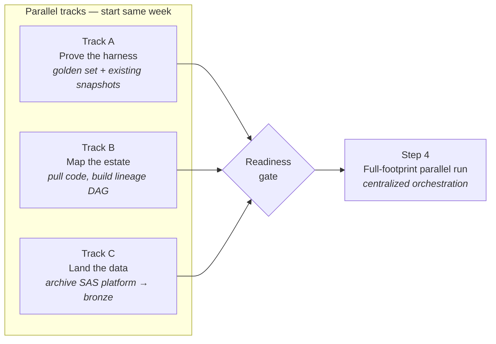
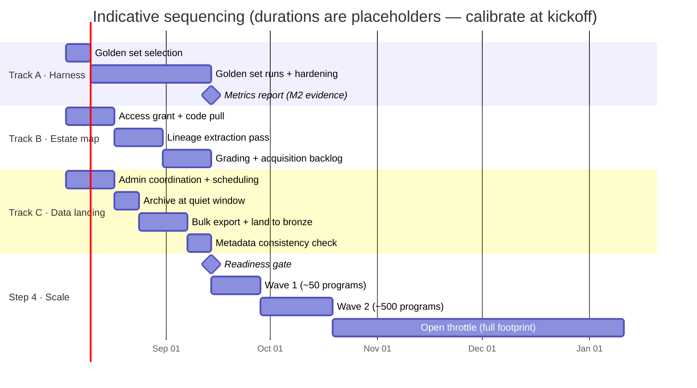
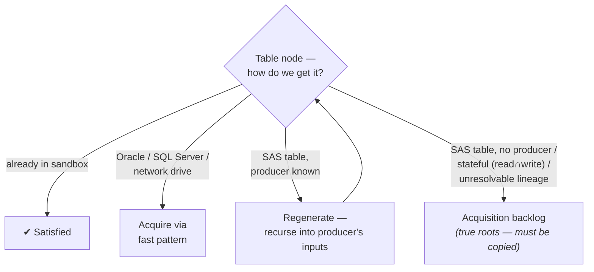
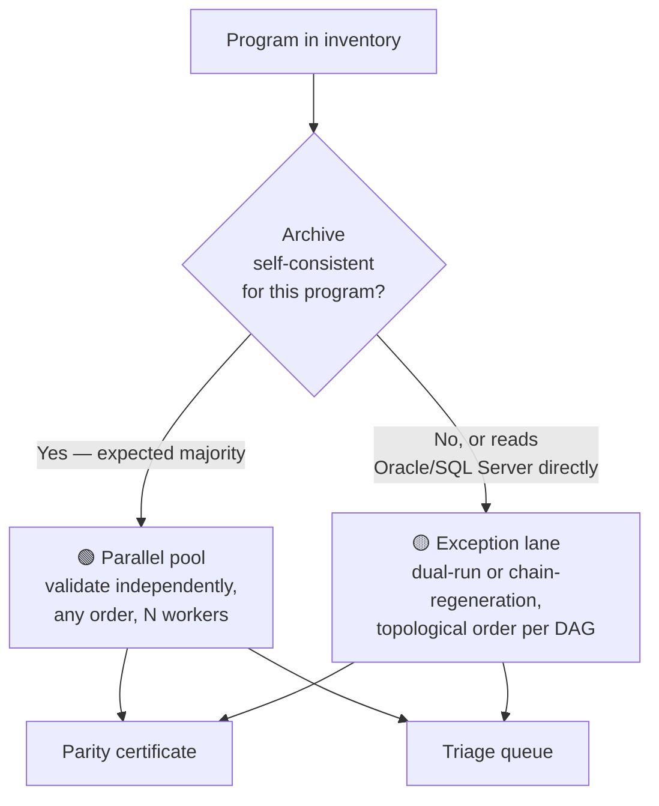
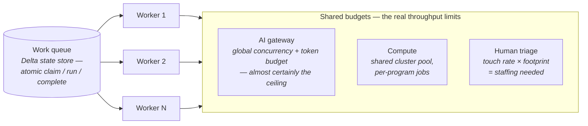

# sas2dbx Roadmap — From Golden Set to Full-Footprint Parallel Migration

**Date:** 2026-07-19
**Status:** Proposed
**Companion docs:** [design spec](superpowers/specs/2026-07-16-sas2dbx-migration-agent-design.md) · [whitepaper](sas2dbx-whitepaper.md)

---

## Executive summary

Four steps, but not four phases. Steps 1–3 have **no dependencies on each
other** — they run as three parallel tracks starting the same week. Step 4
(the full-footprint run) is gated on all three. The platform archive in
Track C is the key unlock: it removes the ordering constraint between
programs, turning the scale run from a dependency-ordered pipeline into an
embarrassingly parallel one.

| Step | Track | What it proves / produces |
|---|---|---|
| 1 | **A — Prove the harness** | Golden set + existing snapshots → pass rate, cost/table, human-touch rate |
| 2 | **B — Map the estate** | All SAS code pulled → lineage DAG, acquisition backlog, retire list |
| 3 | **C — Land the data** | Point-in-time platform archive → bronze layer in Databricks |
| 4 | **Scale run** | Parallel sas2dbx over the whole footprint, centrally orchestrated |

---

## The dependency structure

---

## Track A — Prove the harness (Step 1)

Run sas2dbx end-to-end on the golden set using snapshots that already exist.

**Pick the golden set for variety, not convenience.** Its job is
calibration, so it must stress what the footprint contains: macro-heavy
programs, PROC SQL, MERGE/RETAIN logic, FIRST./LAST. processing, large and
small tables, and at least a few known-ugly programs.

**Exit criteria — the four numbers that size Step 4:**

| Metric | Why it matters downstream |
|---|---|
| Parity pass rate | Forecast of certificates vs. triage volume at scale |
| Gateway calls & cost per program | AI gateway budget is the throughput ceiling — see Step 4 |
| Wall-clock per program | Cluster sizing for the parallel pool |
| Human-touch (triage) rate | Triage staffing = touch rate × footprint |

These four numbers are also the **M2 evidence** for the milestone-gated
funding proposal.

---

## Track B — Map the estate (Step 2)

Pull **all SAS code** (the M1 access grant) and run the lineage-extraction
pass across the inventory: deterministic parsing of inputs/outputs per
program (LLM fallback only for unresolvable macros). Output is the
program↔table DAG plus a grade for every table:

**Deliverables:**

- **Lineage DAG** — also the ordering plan for the exception lane in Step 4.
- **Acquisition backlog** — a Delta table: table name, channel, downstream
  fan-out, est. size, status (`pending` / `landed` / `blocked-on`).
  Prioritized by *fan-out ÷ acquisition cost*. Note: Track C's archive
  bulk-fills most of this list.
- **Retire list** — cross-referenced with the owner survey. Every table
  graded "retire" is a table Step 4 never touches. **Shrinking the footprint
  is the cheapest parallelization there is.**

---

## Track C — Land the data (Step 3)

One well-timed platform archive replaces hundreds of slow SAS pulls.
Schedule it **now** — it has the longest external lead time (admin
coordination, a quiet window, a multi-day export).

**The four rules that make the archive work:**

1. **Time it at a quiet point** — right after a complete batch cycle
   finishes, before the next begins. Chains are internally consistent;
   nothing is mid-flight.
2. **Archive outward, not in place** — bulk-export to the network drive as
   CSV/Parquet so the frozen copy rides the *fast* acquisition pattern.
   An archive that stays on the SAS platform freezes the data but keeps
   the bottleneck.
3. **Capture metadata alongside** — DICTIONARY tables and job logs,
   especially last-modified timestamps. This powers the per-program
   consistency check that routes work in Step 4.
4. **It's a test fixture, not the migration payload** — parity proves the
   *translation* on frozen data (correctness doesn't expire); cutover
   re-runs certified code against live sources. Only re-archive a program
   whose SAS code changes after the archive — have the admin flag those.

---

## Readiness gate

Enter Step 4 when all three are true:

- [ ] **Track A:** golden-set pass rate reviewed and accepted; the four
      sizing metrics published.
- [ ] **Track B:** DAG built; every in-scope table graded; retire list
      applied to the footprint.
- [ ] **Track C:** archive landed in bronze; metadata consistency check run
      over the footprint.

---

## Step 4 — The full-footprint parallel run

### Why the archive unlocks parallelism

For any program, parity needs inputs and ground-truth outputs **from the
same moment**. Without the archive, that forces topological order —
downstream programs wait for upstream certificates so intermediates can be
regenerated. With the archive landed, *every intermediate already exists in
bronze*. The metadata check ("were this program's inputs last written before
its output, within the same batch cycle?") splits the footprint into two
lanes:

In the exception lane, parity **composes**: an upstream program's
certificate makes its Databricks output a certified stand-in for the SAS
intermediate, so downstream validation chains through certificates in
topological order.

### Orchestration = one queue, three shared budgets

Programs are independent (each runs in its own sandbox schema); the
orchestrator's real job is managing what's *contended*:

- **AI gateway:** golden-set calls-per-program × footprint ÷ rate limit =
  true calendar time. Know this number before promising dates.
- **Workers:** generalize `Migrate_Batch.py` from one walker to N by adding
  atomic program-leasing to `DeltaStateStore` (claim → run → complete).
  Resumability already exists.
- **Triage:** staff it from the Track A touch rate, or it becomes the
  silent bottleneck.

### Ramp in waves — don't big-bang

| Wave | Size | What you're watching |
|---|---|---|
| 1 | ~50 programs | Pass rate by program family; gateway spend per program |
| 2 | ~500 programs | Triage queue depth vs. staffing; budget burn vs. forecast |
| 3 | Full footprint | Sustained run rate vs. glidepath |

If pass rate degrades on a program family (e.g., a macro pattern the
translation cribsheet misses), fix the cribsheet once at wave 1 — not
after burning repair budget across 10,000 programs.

---

## Mapping to the funding milestones

This roadmap is the operational expansion of the milestone plan — nothing
in the executive deck changes; this slots underneath it.

| Milestone | Roadmap element | The evidence it produces |
|---|---|---|
| **M1 — Full Access + True Inventory** | Track B (+ access for Track C) | Every table graded; true surface known |
| **M2 — Proof on a Slice** | Track A | Pass rate, cost/table, touch rate, wall-clock |
| **M3 — Scale to Glidepath** | Step 4 | Sustained run rate vs. 9/30/2027; burn vs. forecast |
